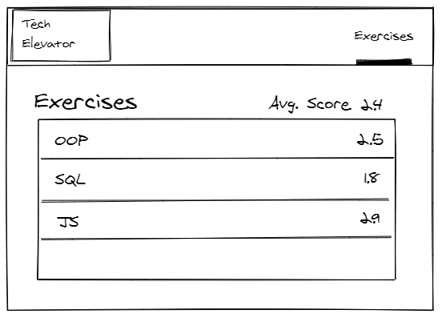

# Tech Elevator Developer Coding Assessment

Welcome! We are very excited that you have chosen to pursue a developer position with Tech Elevator!

## Your Mission

Currently, we have a single page available that displays a list of exercises. However, we've realized that we need to enhance this functionality.

On the exercises page, we'd like you to add the average scores for each exercise, as well as the average score for all of the exercises.

Based on the data returned from the API, we expect the following to be the average scores for exercises:

    Intro to OOP: 2.60
    Intro to SQL: 1.70
    Polymorphism : 2.00
    Advanced JS: 2.32
    MVC - Views Part 1: 2.16
    MVC - Views Part 2: 2.50
    REST APIs: 2.06
    CSS Selectors: 2.20
    Average Overall Score: 2.19

This might look something like the following:

Next, we'd like to have a page where we can view all of the scores for a specific exercise. For instance, we'd like to click on the OOP exercise and look at the breakdown of scores for each student for that exercise. We should also be able to see the name of the exercise on the page, and would also like to see the name and profile picture for each of the students. It would also be nice to see the average score for the exercise displayed on this page as well.

Finally, we should be able to update the score for any student on this page. Ideally, the scores will be updated after we've changed the value without the need to click a Save or Submit button. The average score for all students should also be updated as the scores are changed.

## About the Project

This application is a Vue JS application that uses a tool called JSON Server to host a file based REST API.

To get things started, you should run the command `npm install` at the root of the project.

Next, to get both the API server and the Vue application running locally, run the command `npm run serve`.

The web application will be running at `http://localhost:8080`, and the API will be running at `http://localhost:3000`.

### API

The API has the following endpoints:

`/students` - Used to get all of the students. The student data includes the name of the student, the avatar (profile picture for the student), and an id.

`/exercises` - Used to get all of the exercises. The exercise data include the name and id of the exercise.

`/student-scores` - Used to get all of the scores for students. This endpoint returns an array of scores for students, and each object includes the id of the exercise, the id of the student, and the score for the exercise.

When working with the API, you are also able to load associated objects. For instance, if you wanted to get all of the exercises with the scores, you could make a GET request like `/exercises?_embed=studentScores`.

The API also supports all other HTTP methods, such as PUT, POST, and DELETE.

The data json-server is using is the `./json-server/data.json` file. If you would like to reset this file back to the original state at anytime, replace the contents of the file with the json object in the `./json-server/data.original.json` file.

For more information related to JSON server, check out [the documentation](https://github.com/typicode/json-server).

**NOTE: You will not need to make any changes to the API for this project.**

### Tests

There are two types of tests available for the student dashboard project. There are end-to-end tests and unit tests. To run the unit tests, run the command `npm run test:unit`. To run the end-to-end tests, run the command `npm run test:e2e`.

## Evaluation Criteria

We will be looking for the following:

- Code is clean and thoughtful.
- Code is tested completely.
- Code is documented where necessary.
- Commit history includes clear commit messages.
- All of the requested features are implemented.
- A markdown document that discusses your thoughts and approach to your solution.

While we will encourage pair programming on the development team, it is our expectation that this is solely your work.

## Submit Your Work

To submit your work, create a [git bundle](http://schacon.github.io/git/git-bundle.html) of the entire repository using the command `git bundle create your-name-assessment.bundle --all`, and send the file to `jobs+bos@techelevator.com`.

## Questions?

If you should have any questions related to features or expectations, we encourage you to reach out. Please send questions to `jobs+bos@techelevator.com`.
